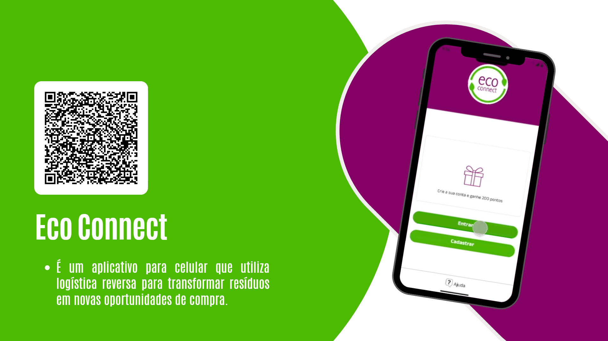

# prototipo-App_Sustentabilidade

🎉 Conclusão do Curso de DESIGN UX/UI - PROGRAMA CODEAR FUTURA 2024 na Jump! Educación 🎉

Estou muito feliz em compartilhar que concluí o curso de DESIGN UX/UI pelo Programa de Bolsas CODEAR FUTURA 2024! 🚀💪💜

Durante essa jornada, aprendi e apliquei metodologias e ferramentas essenciais, como Design Thinking e Figma em:

Metodologias: Aprofundei meu conhecimento em Design Thinking para criar projetos centrados no usuário.

Ferramentas: Trabalhamos com o Figma para prototipagem interativa, colaborando eficazmente com o grupo.

Projeto Final: Participei de um projeto em equipe, desde a pesquisa de usuários até a entrega de um protótipo funcional.

Habilidades: Adquiri habilidades em UX/UI, incluindo pesquisa de usuários, wireframes e testes de usabilidade.

Agradeço à equipe da Jump! Educación 
CODEAR FUTURA, instrutores Maria Albuquerque e Valentina Castiglioni as colegas Bianca Farias , Cíntia e Maysa pelo apoio e colaboração. Esta experiência enriquecedora contribuirá para meu crescimento profissional.

Desenvolvemos o app Eco Connect para o descarte correto de embalagens de maquiagens, com o tema Sustentabilidade.

Confira o nosso protótipo: 
https://lnkd.in/dJcEi4DX

## Captura de Tela

hashtag#UXDesign hashtag#UIDesign hashtag#DesignThinking hashtag#Figma hashtag#CODEARFUTURA hashtag#UserExperience hashtag#UserInterface
